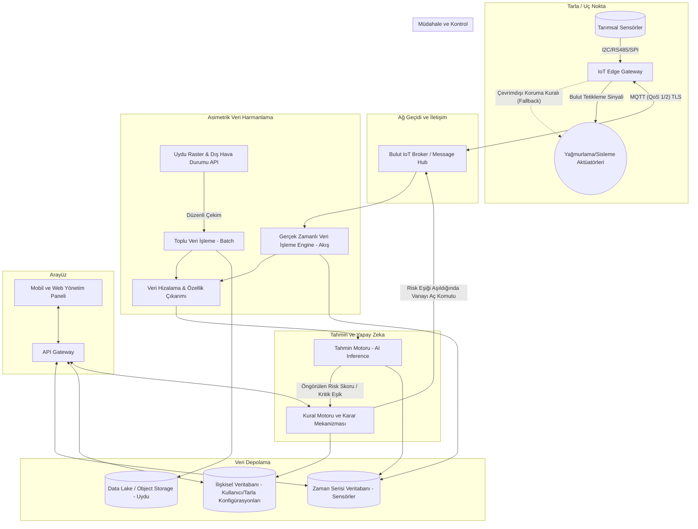

# Otonom Zirai Don Erken Uyarı ve Müdahale Sistemi Mimarisi

Bu belge, tarımsal arazilerde yaşanan don olaylarını önceden tahmin edip otonom müdahale gerçekleştirecek IoT, veri analitiği ve yapay zeka tabanlı sistemin yazılım ve altyapı mimarisini tanımlar.

## 1. Mimarinin Temel Prensipleri
- **Kesintisiz Otonomi (Zero-Latency & Edge Fallback):** Bulut bağlantısı kopsa dahi tarladaki yerel donanımın kritik müdahaleyi anında yapabilmesi garanti altına alınmalıdır.
- **Asimetrik Veri Harmanlama:** Düşük frekanslı/geniş ölçekli makro uydu verileri ile yüksek frekanslı yerel mikro-klima (sensör) verilerinin zaman ve uzam bazında veri gölünde (data lake) eşzamanlanması.
- **Hata Toleranslı Haberleşme:** Sinyalin zayıf olabileceği tarlalardaki veri akışının kopmalara karşı tamponlanması (buffering) ve kayıpsız aktarılması.
- **Modüler Ölçeklenebilirlik:** İhtiyaca göre tek dönümden yüz binlerce dönüme kadar büyüyebilecek bulut-agnostik mikroservis mimarisi.

---

## 2. Sistem Mimarisi Şeması (Mermaid)

---

## 3. Katmanların Tasarım Detayları

### 3.1. Uç Bilişim ve Donanım Katmanı (Edge & Actuation Layer)
İnsan müdahalesi olmadan çalışacak otonom bir sistemde beynin sadece bulutta olması risklidir. İnternet kesilirse ürünler donarak ölür. Bu yüzden **"Edge Computing (Uç Bilişim)"** şarttır.
- **Edge Gateway (Ağ Geçidi):** Raspberry Pi, endüstriyel Controller, ya da ESP32/ESP8266 gruplarından oluşur. Yerel bir kuyruklama servisine (örn. Mosquitto Broker ya da basit bir bellek yapısına) sahiptir.
- **Offline Fallback (Çevrimdışı Güvenlik Ağı):** İnternet tamamen kesildiğinde Gateway içindeki yerel bir "Rule Engine" (Kural Motoru) devreye girer. *Örneğin: "Öngörü sistemine bağlanamıyorum, yerel sensörde sıcaklık 1.2°C'ye düştü, yağmurlamayı hemen başlat."* Bu sayede gecikmesizlik ve hata toleransı sağlanır.

### 3.2. Asimetrik Veri Harmanlama Katmanı (Data Pipeline)
Sensör verisi saniyede/dakikada bir gelirken (Mikro), Copernicus/Landsat uydularından gelen NDVI veya genel nem haritası günde bir kere (Makro) gelir.
- **Gerçek Zamanlı Hat (Stream Processing):** Apache Kafka / Flink ya da AWS Kinesis gibi bir omurga kurulur. Bu sistem veriyi anında TSDB'ye (Zaman Serisi Veritabanı) kaydeder.
- **Zaman/Uzam Hizalaması (Feature Alignment):** Yüksek frekanslı verinin yanına, en son çekilen uydu görüntüsünün makro değerleri kolonlar halinde bağlanır. Böylece AI modeli tarlanın o noktasındaki mikro-klima ile bölgenin makro rüzgar/nem örüntüsünü aynı anda "Time Window" bazında görebilir.

### 3.3. Yapay Zeka ve Tahmin Motoru (Prediction/Inference Layer)
Sistemin beynidir. Sadece anlık sıcaklığa değil, çiğ noktası (dew point), rüzgar soğutması, toprak nemi ve yukarı atmosfere bakarak birkaç saat sonrasını tahmin eder.
- Zaman serisi öngörüleri algoritmalarına özgü modeller (LSTM, Temporal Convolutional Networks veya performans odaklı XGBoost / LightGBM) kullanılmalıdır.
- Model sürekli API arkasında çalışır (Örn. Python FastAPI). Yeni sensör satırı girdiğinde anında don ihtimali (Örn: %87) ve kırılım sıcaklığını üretir.

### 3.4. Kural Motoru ve Otonom Tetikleme (Action & Rule Engine)
Bu modül tahmin sonuçlarını değerlendirir ve otonom komutları fiziksel dünyaya indirger.
- AI motoru sadece tahmin yapar, ancak "Valfi Aç" demez. Vanayı açacak olan Kural Motorudur.
- Kural Motoru, kullanıcının ayarladığı tarla sınırlarına bakar (Örneğin çiçeklenme dönemindeki kayısı ağaçları ile filizlenmiş patates tarlasının don hassasiyeti farklıdır). AI tahmini o ürünün kritik eşiğini aşarsa MQ üzerinden cihaza "Aktifleş" payload'unu yayınlar.
- Haberleşme için **MQTT protokolü** kullanılmalıdır (Sensörden buluta ve buluttan aktüatöre çift yönlü bağlantı). Kırılgan tarla ağlarında paket kaybını önlemek için Quality of Service değeri **QoS 1 (En az bir kere iletim) veya QoS 2 (Kesinlikle bir kere iletim)** olarak seçilmelidir.

---

## 4. Hata Toleransı & Güvenilirlik

1. **Sensör Kopması (Sensor Failure):** Sahadaki bir sıcaklık sensörü arızalandığında sistem, "Komşu Sensörler İnterpolasyonu" (Spatial Interpolation) veya uydudan gelen sanal istasyon hava durumu verisi üzerinden (Soft-Sensor) açık veriyi doldurur ve sistem durmadan kör uçuşu engeller.
2. **Paket Kopmaları:** MQTT protokolü sayesinde veri iletilemezse Edge Gateway üzerinde depolanır, internet geldiği an veritabanına basılır; böylece modelin tarihi eğitim verisinde kör nokta (gap) oluşmaz.
3. **Mekanik Limitler:** Sistemin tarlayı gereksiz yere gölete çevirmesini önlemek için "Maksimum sulama süresi" veya topraktaki doymuşluk oranına bağlı nem limiti "Edge" kurallarına işlenir. 

## 5. Yazılım Teknolojisi Önerileri
- **IoT Altyapısı (MQTT):** AWS IoT Core, EMQX, ya da Eclipse Mosquitto.
- **Ana Servisler:** Python (Yapay zeka ve asimetrik veri hizalama manipülasyonları için - Pandas/Numpy/SciPy).
- **Stream Processing:** Apache Kafka, AWS Kinesis.
- **Veritabanları:** InfluxDB veya TimescaleDB (TSDB), PostgreSQL (İlişkisel/Kurallar), AWS S3 (Uydu resimleri/Raster data).
- **Dağıtım (Deployment):** Docker & Kubernetes (Gecikmeyi azaltmak için otomatik yük devretme/High Availability).
